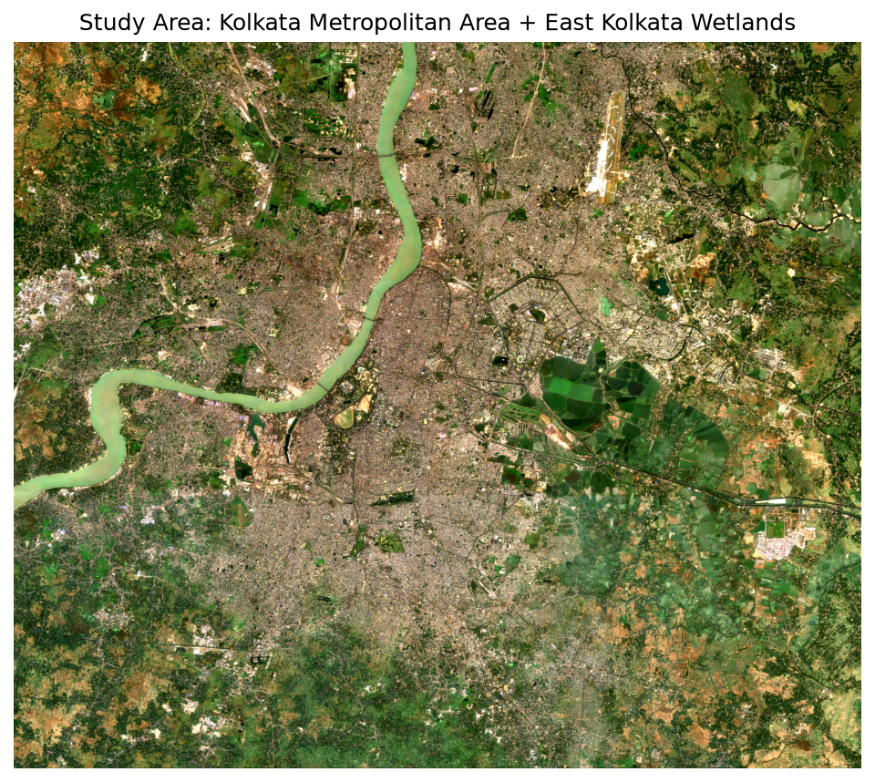
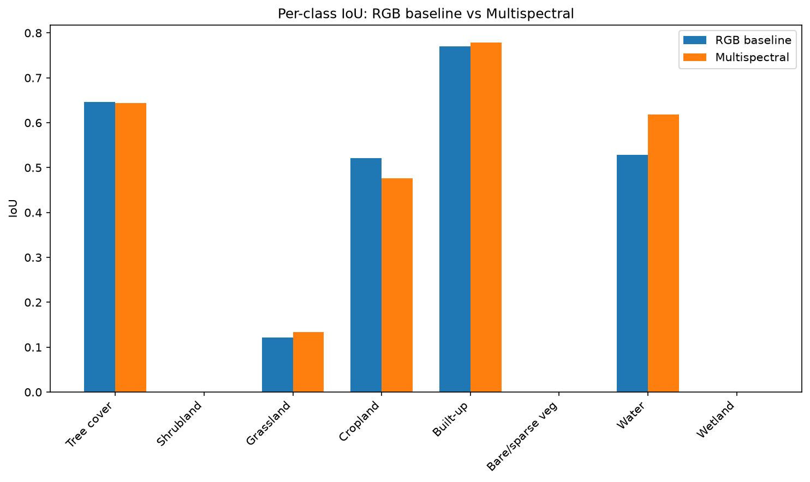
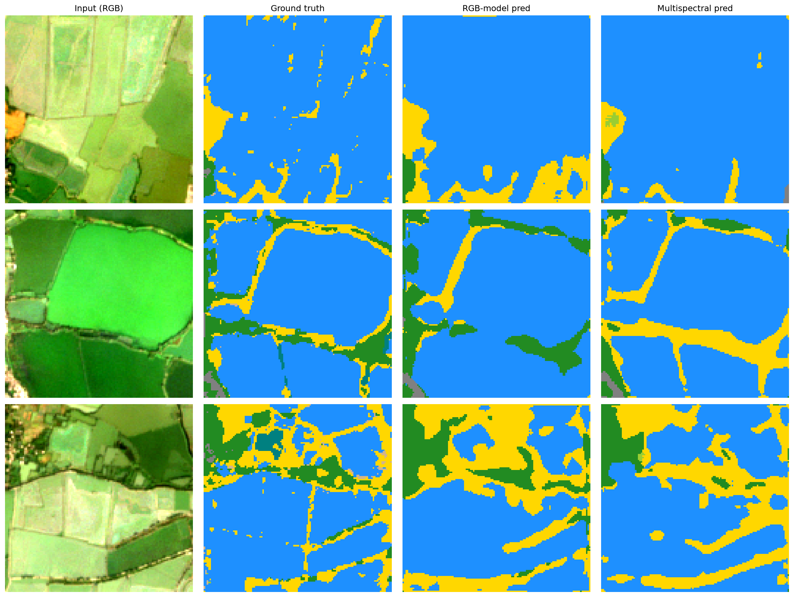
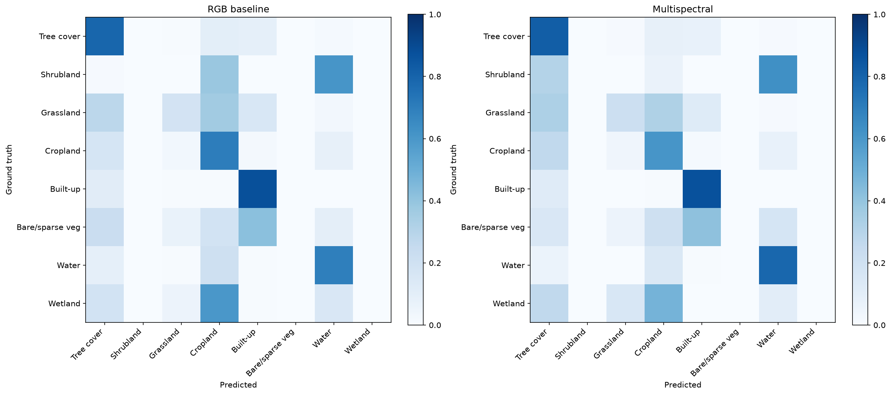

# Project 1: LULC Classification with Sentinel-2 Multispectral Bands

**Part of:** GeoAI + Remote Sensing ML Portfolio (Project 1 of 8)
**Status:** Complete

## The question this project answers

> Does using the full multispectral signal (not just RGB) improve land cover
> classification, and by how much?

Standard computer vision models are built for RGB — what the human eye
sees. Sentinel-2 satellites also capture near-infrared, red-edge, and
short-wave infrared light, which carry information about vegetation health,
soil moisture, and built material invisible in an RGB photo. This project
built an RGB-only baseline and a 13-channel multispectral model, trained
both under identical conditions, and compared them directly.

## Geography context

Land cover mapping underpins deforestation monitoring, urban sprawl
tracking, agricultural yield estimation, and climate policy. This project
maps land cover in the **Kolkata Metropolitan Area including the East
Kolkata Wetlands** — a Ramsar-designated wetland site that naturally treats
a large share of the city's sewage through fish ponds and agriculture
(locally called *bheris*). The AOI was chosen for genuine class diversity
(water, built-up, cropland, wetland, vegetation) in one compact region, not
just convenience.

## Result

| Metric | RGB baseline | Multispectral | Delta |
|---|---|---|---|
| Pixel accuracy | 0.7682 | 0.7678 | ~0 |
| Mean IoU (present classes) | 0.3235 | 0.3313 | +0.0078 |
| Water IoU | 0.5286 | 0.6185 | **+0.0899** |
| Built-up IoU | 0.7705 | 0.7785 | +0.0080 |
| Grassland IoU | 0.1210 | 0.1334 | +0.0124 |
| Cropland IoU | 0.5216 | 0.4761 | -0.0455 |
| Tree cover IoU | 0.6464 | 0.6442 | ~0 |

**Multispectral input improves segmentation, most clearly on Water (+9%
IoU)** — consistent with the hypothesis that SWIR/NIR bands carry
water-surface information invisible to RGB. Cropland and Tree cover showed
no benefit or a slight regression. A second unweighted run showed the same
direction of effect but a smaller delta (0.008 vs 0.021) — no fixed random
seed was used, so report the *direction* of the finding, not the exact
magnitude, unless averaged over multiple seeds.

## Known limitation: Wetland classification failed

Despite Wetland being the geographic highlight of this AOI, both models
scored ~0 IoU on it. Wetland is only 0.68% of pixels in the test set —
likely just a handful of tiles contain it at all. Class-weighted loss
(inverse frequency, capped at 10x) was tried specifically to fix this: it
raised Wetland IoU marginally (0.009 → 0.036) but reduced every major
class's performance, a bad trade that was reverted. **Conclusion: this is a
data scarcity problem, not a loss-function problem** — fixing it would need
either a larger/different AOI with more wetland coverage, or targeted
oversampling, not just reweighting the existing few examples.

## Pipeline stages

| Stage | What happened |
|---|---|
| `01_data_acquisition/` | Pulled Sentinel-2 L2A (10 bands) + ESA WorldCover labels via Google Earth Engine, Kolkata AOI, Nov–Feb dry season, 52 scenes composited |
| `02_preprocessing/` | Computed NDVI/NDWI/NDBI (10→13 channels), tiled into 128×128 patches, split 70/15/15 by spatial block |
| `03_model_architecture/` | U-Net (segmentation-models-pytorch) with ResNet34 encoder; RGB (3ch, full pretrained) vs multispectral (13ch, partial pretrained) |
| `04_training/` | Trained both on free-tier Colab (T4 GPU), 30 epochs, Adam, checkpointed to Drive |
| `05_evaluation/` | Per-class IoU, confusion matrices, prediction visualizations, RGB vs multispectral comparison |

Each folder has its own README with full decision rationale — this file is
the summary; those are the detail.

## Things that went wrong, and what they taught

**SSL certificate error on first GEE auth (macOS + python.org build)**
`ee.Authenticate()` failed with `CERTIFICATE_VERIFY_FAILED`. python.org's
Python doesn't auto-install root certificates. Fixed by running Python's
bundled `Install Certificates.command`.

**Drive export size limits and silent float64 upconversion**
`ee.Image.median()` upconverts pixel values to float64 even though
Sentinel-2 is natively int16 — a composite estimated at ~230MB actually
became ~1.1GB, and Earth Engine's 48MB-per-request cap made the naive
download fail outright. Fixed by casting back to `int16` before export and
switching to `geemap.download_ee_image()` (auto-tiles large images) instead
of `ee_export_image()` (single request, no tiling). **Takeaway: any reducer
that changes dtype should be checked against the source band's dtype before
export, never assumed to preserve it.**

**Spatial split ratios were wrong (64/30/6% instead of 70/15/15)**
Initial block-to-split assignment used `hash(block_id) % 100`, which
doesn't distribute evenly over a small number of blocks. Fixed by
enumerating all blocks, shuffling with a fixed seed, and assigning
proportionally.

**cuDNN / CUDA errors during training (three distinct issues, one at a time)**
1. `CUDNN_STATUS_INTERNAL_ERROR` — GPU memory pressure on free-tier T4;
   fixed by lowering batch size 16→8 and disabling `cudnn.benchmark`.
2. `CUDA error: device-side assert triggered` at `model.to(DEVICE)` — a
   **poisoned CUDA context** left over from the previous crash; "Restart
   session" didn't clear it, required "Disconnect and delete runtime" for a
   genuinely fresh GPU allocation.
3. The *actual* root cause underneath both: **raw WorldCover pixel values
   (10-100) were fed directly into `CrossEntropyLoss`**, which expects
   class indices 0-10. A `remap_labels()` function existed but was never
   called in the dataset. This produced an out-of-bounds class index,
   which is exactly what a device-side assert catches. **Takeaway: a CUDA
   device-side assert on a classification/segmentation task is almost
   always an out-of-range label, not a hardware problem** — check label
   ranges before suspecting the environment.

**Google Drive storage strategy**
Made a deliberate choice to keep raw data local rather than in Drive
(~230MB composite × 8 planned projects adds up), using
`geemap.download_ee_image()` for direct-to-disk downloads. Checkpoints
during training still used Drive (necessary — Colab session disk is
ephemeral and free-tier sessions can disconnect), but limited to 2
overwritten files per model (`latest.pt`, `best.pt`) rather than one file
per epoch, to avoid the same bloat problem for a different reason.

**Class-weighted loss experiment (see Limitation above)**
Tried and reverted — documented as a negative result, not hidden.

## Tech stack

- **Data**: Google Earth Engine (Sentinel-2 L2A, ESA WorldCover v200), `geemap`/`geedim` for local download
- **Preprocessing**: `rasterio`, `numpy`
- **Model**: PyTorch, `segmentation-models-pytorch` (U-Net, ResNet34 encoder)
- **Training**: Google Colab (free tier, T4 GPU)
- **Evaluation/visualization**: `matplotlib`

## Hardware

- Prototyping: Mac M4 (local)
- Training: Google Colab, free tier (no Colab Pro)
- Final visualization/inference: Mac M4, CPU (small enough scale to not need GPU)

## Honors program framing

This project demonstrates: atmospheric correction and sensor calibration
concepts, spectral index theory (NDVI/NDWI/NDBI), land cover classification
schemes (ESA WorldCover taxonomy), a controlled comparative experiment
design (RGB vs. multispectral) with a documented negative result
(class-weighting), and engineering judgment through several real debugging
cycles — not just a tutorial walkthrough.

---
© 2026 Tamojeet - Licensed under the MIT License.